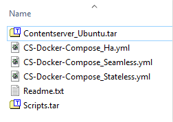

## How to setup Documentum Content Server docker on your Windows localhost

This project is useful for anyone who just want to get the CS up and running without having to really understand Docker 

#### Pre-requisites
  - [Docker for Windows](https://docs.docker.com/docker-for-windows/install/)
  - Content server docker tar from OpenText. I am using the Ubuntu verion here : contentserver_docker_ubuntu.tar
#### Preparation
  - Extract contentserver_docker_ubuntu.tar to a folder
  - Extract Scripts.tar that came inside contentserver_docker_ubuntu.tar into the same location. The folder would now look like :
   
    
  - Update .yml file. Replace `CS-Docker-Compose_Stateless.yml` with [CS-Docker-Compose_Stateless.yml](CS-Docker-Compose_Stateless.yml)
    - Changes in this file include direct property setting instead of environment variables
    - Use local volumes
    - Use the new network created so that the DB is reachable
    - Update of the base image, host and container names
  - Update the `CS-Docker-Compose_Stateless.yml` `DOCKER_HOST` value to that of your host. Use `ipconfig` to find the IP address.

#### Building the container

Follow the commands in the given order in a Windows Powershell prompt 

- Get the Postgres image

    `docker pull postgres`
- Create a network for Postgres and will later be used for the Content server also

    `docker network create --driver bridge postgres-network`
- Create a new volume for the DB

    `docker volume create --name volume-postgresql -d local`
- Run the DB with the new network and volume

   `docker run --name postgres_dctm --network postgres-network --volume volume-postgresql -e POSTGRES_PASSWORD=password -d postgres`
- Create a DB dat file to be used by the Content Server (note the name of the Docbase is DocbaseName)

    `docker exec -it postgres_dctm mkdir /var/lib/postgresql/data/db_DocbaseName_dat.dat`

    `docker exec -it postgres_dctm chown postgres:postgres /var/lib/postgresql/data/db_DocbaseName_dat.dat`
- Load the image that came with the download from OpenText

    `docker load -i Contentserver_Ubuntu.tar`
- Compose the container with the image

    `docker-compose -f CS-Docker-Compose_Stateless.yml up -d`
- Start the container

    `docker container start documentumcs`
- The docbroker, docbase, method server all are going to get created. You can check the logs using the command : 

    `docker exec -it documentumcs tail -f /opt/dctm_docker/logs/cs_host.log`

It can take at least half an hour to have the docbase created

The docbase creation logs can be checked using : 

   `docker exec -it documentumcs tail -f /opt/dctm/product/16.4/install/logs/install.log`
    
#### Test

Test the connection using [LocalContentServerDockerConnectionTets](src/test/java/ak/dctm/csdocker/LocalContentServerDockerConnectionTest.java)
